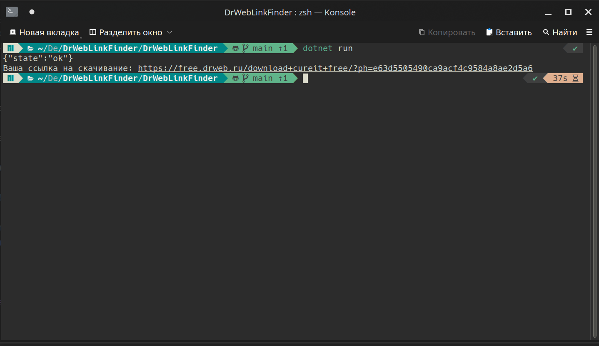

# DrWebLinkFender
Это приложение автоматически посылает запрос на скачивание, подставляя в запрос случайные имя/фамилию и временную почту.  
Использует api временной почты, чтоб получить сообщение, декодировать, спарсить ссылку на скачивание и вывести её.  
  
Приложение автоматизирует действия, которые раньше приходилось проделывать самому.  
